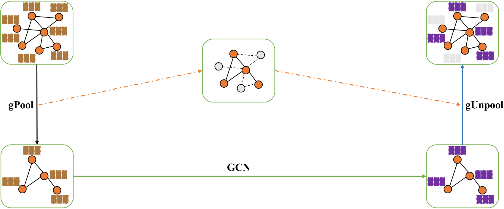
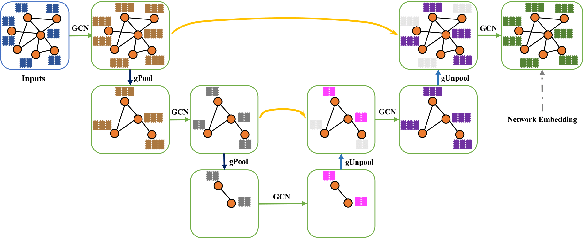

PyTorch Implementation of Graph U-Nets
======================================

Created by [Hongyang Gao](http://people.tamu.edu/~hongyang.gao/), and
[Shuiwang Ji](http://people.tamu.edu/~sji/) at Texas A&M University.

About
-----

PyTorch implementation of Graph U-Nets. Check http://proceedings.mlr.press/v97/gao19a/gao19a.pdf for more information.

Methods
-------

### Graph Pooling Layer

### Graph Unpooling Layer

### Graph U-Net

Installation
------------

The implementation is based on the pytorch version of DGCNN.

    unzip pytorch_structure2vec-master.zip

Then, under the "pytorch_structure2vec-master/s2vlib/" directory, type

    make -j4

to build the necessary c++ backend.

Type

    ./run_GUNet.sh DATA FOLD

to run on dataset using fold number (1-10). You can run ./run_GUNet.sh DD 0 to run on DD dataset with 10-fold cross validation.

Code
----

The detail implementation is in ops.py

Datasets
--------

Check the "data/README.md" for the format. 

Reference
---------

If you find the code useful, please cite our paper:

    @inproceedings{gao2019graph,
        title={Graph U-Nets},
        author={Gao, Hongyang and Ji, Shuiwang},
        booktitle={International Conference on Machine Learning},
        pages={2083--2092},
        year={2019}
    }
